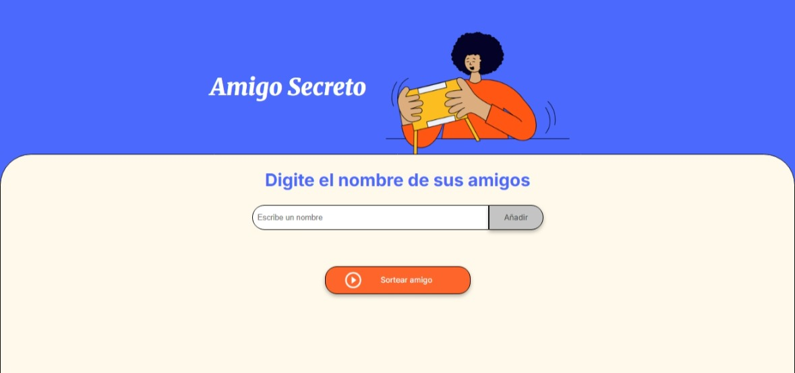
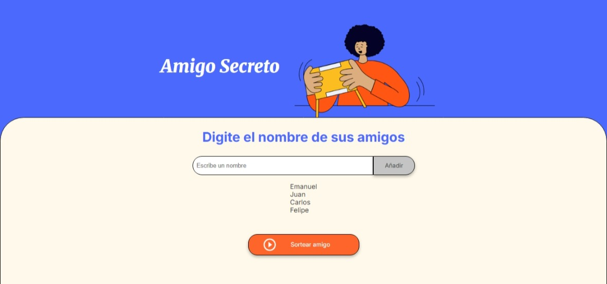
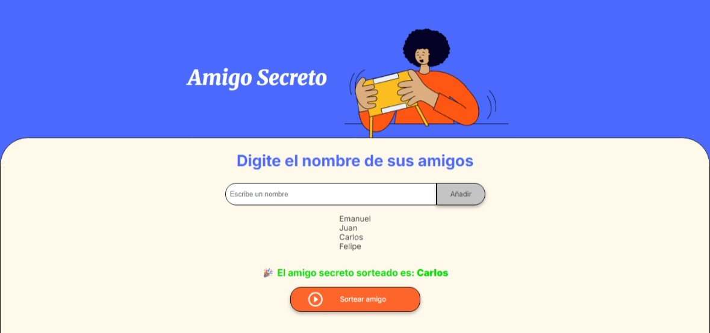

# 🎉 Challenge Amigo Secreto


---

## 📋 Índice

---

- [Descripción del Proyecto](#-descripción-del-proyecto)
- [Funcionalidades](#-funcionalidades)
- [Cómo Usar la Aplicación](#-cómo-usar-la-aplicación)
- [Instalación y Ejecución](#-instalación-y-ejecución)
- [Tecnologías Utilizadas](#-tecnologías-utilizadas)
- [Estructura del Proyecto](#-estructura-del-proyecto)
- [Capturas de Pantalla](#-capturas-de-pantalla)
- [Autor](#-autor)

---

## 📖 Descripción del Proyecto

**Challenge Amigo Secreto** es una aplicación web interactiva desarrollada como parte del programa **ONE (Oracle Next Education)** en colaboración con **Alura**. Este proyecto tiene como objetivo principal fortalecer las habilidades en **lógica de programación** mediante el desarrollo de una herramienta que facilita la organización de sorteos de amigo secreto.

La aplicación permite a los usuarios agregar nombres de participantes y realizar un sorteo aleatorio para determinar quién será el "amigo secreto". Es perfecta para organizar intercambios de regalos en oficinas, familias, grupos de amigos o cualquier evento festivo.

### 🎯 Objetivos de Aprendizaje

- Aplicar conceptos de **lógica de programación**
- Trabajar con **arrays** y **funciones** en JavaScript
- Implementar **validaciones** y **condicionales**
- Manipular el **DOM** para crear interfaces interactivas
- Generar **números aleatorios** para sorteos
- Crear una experiencia de usuario intuitiva

---

## ⚙️ Funcionalidades

### ✅ Funcionalidades Principales

- **➕ Agregar Participantes**: Permite ingresar nombres de personas que participarán en el sorteo
- **📝 Validación de Datos**: 
  - No permite nombres vacíos
  - No acepta nombres con espacios
  - No acepta nombres con números
- **📋 Lista Visual**: Muestra todos los participantes agregados en una lista ordenada
- **🎲 Sorteo Aleatorio**: Selecciona aleatoriamente un participante de la lista
- **🎨 Diseño Moderno**: Interfaz limpia y atractiva con animaciones sutiles

### 🔧 Funcionalidades Técnicas

- **Manipulación del DOM**: Actualización dinámica de elementos HTML
- **Gestión de Arrays**: Almacenamiento y manipulación de la lista de participantes
- **Generación de Números Aleatorios**: Algoritmo de sorteo imparcial
- **Validación de Entrada**: Sistema robusto de validación de datos
- **Manejo de Errores**: Alertas informativas para guiar al usuario

---

## 🚀 Cómo Usar la Aplicación

### Paso 1: Agregar Participantes
1. Escribe el nombre de un participante en el campo de texto
2. Haz clic en el botón **"Añadir"** o presiona Enter
3. El nombre aparecerá en la lista de participantes
4. Repite el proceso para agregar más participantes

### Paso 2: Realizar el Sorteo
1. Asegúrate de haber agregado al menos un participante
2. Haz clic en el botón **"Sortear amigo"** 
3. El sistema seleccionará aleatoriamente a un participante
4. El resultado se mostrará destacado en la pantalla

### 📝 Reglas de Validación

- **Nombres válidos**: Solo se aceptan nombres sin espacios ni números
- **Lista mínima**: Debe haber al menos un participante para realizar el sorteo
- **Duplicados**: El sistema previene agregar el mismo nombre dos veces

---

## 💻 Instalación y Ejecución

### Requisitos Previos
- Navegador web moderno (Chrome, Firefox, Safari, Edge)
- No se requieren instalaciones adicionales

### Pasos de Instalación

1. **Clona el repositorio**:
   ```bash
   git clone https://github.com/ema28pro/Challenge-Amigo-Secreto.git
   ```

2. **Navega al directorio del proyecto**:
   ```bash
   cd Challenge-Amigo-Secreto
   ```

3. **Abre el archivo `index.html`**:
   - Opción 1: Haz doble clic en `index.html`
   - Opción 2: Abre el archivo desde tu navegador
   - Opción 3: Usa un servidor local como Live Server en VS Code

### 🌐 Ejecución con Servidor Local

Para una mejor experiencia de desarrollo, recomendamos usar un servidor local:

```bash
# Si tienes Python instalado
python -m http.server 8000

# Si tienes Node.js instalado
npx serve .

# Luego abre http://localhost:8000 en tu navegador
```

---

## 🛠️ Tecnologías Utilizadas

| Tecnología       | Versión | Propósito                                     |
| ---------------- | ------- | --------------------------------------------- |
| **HTML5**        | -       | Estructura y semántica de la aplicación       |
| **CSS3**         | -       | Estilos, diseño responsivo y animaciones      |
| **JavaScript**   | ES6+    | Lógica de programación y manipulación del DOM |
| **Google Fonts** | -       | Tipografías Inter y Merriweather              |

### 📚 Conceptos Implementados

- **DOM Manipulation**: `getElementById`, `createElement`, `appendChild`
- **Event Handling**: `onclick`, validación de formularios
- **Arrays**: `push`, `length`, acceso por índice
- **Math Functions**: `Math.random()`, `Math.floor()`
- **String Methods**: `trim()`, `includes()`
- **Regular Expressions**: Validación de patrones
- **Conditional Logic**: `if/else`, operadores lógicos

---

## 📁 Estructura del Proyecto

```
Challenge-Amigo-Secreto/
│
├── 📄 index.html          # Estructura HTML principal
├── 🎨 style.css           # Estilos y diseño responsivo
├── ⚡ app.js              # Lógica JavaScript
├── 📖 README.md           # Documentación del proyecto
│
└── 📁 assets/             # Recursos gráficos
    ├── 🖼️ amigo-secreto.png     # Imagen principal
    └── ▶️ play_circle_outline.png # Ícono del botón sortear
```

### 📄 Descripción de Archivos

- **`index.html`**: Contiene la estructura HTML con elementos semánticos y accesibles
- **`style.css`**: Define todos los estilos, incluyendo diseño responsivo y animaciones
- **`app.js`**: Implementa toda la lógica de programación, validaciones y sorteo
- **`assets/`**: Directorio con imágenes optimizadas para la interfaz

---

## 📸 Capturas de Pantalla

### 🏠 Pantalla Principal


### 📋 Lista de Participantes


### 🎊 Resultado del Sorteo


---

## 👨‍💻 Autor

**Emanuel Lopez** - *ema28pro*

- 🌐 **GitHub**: [@ema28pro](https://github.com/ema28pro)
- 💼 **LinkedIn**: [LinkedIn](https://www.linkedin.com/in/emanuel-lopez-f/)

### 🏆 Sobre el Desarrollador

Estudiante del programa **ONE (Oracle Next Education)** en colaboración con **Alura**, enfocado en desarrollar habilidades sólidas en programación frontend y lógica de programación. Este proyecto representa parte del aprendizaje práctico en JavaScript y desarrollo web.

---

## 🎓 Agradecimientos

- **Oracle**: Por proporcionar la plataforma educativa ONE
- **Alura**: Por los excelentes cursos y challenges prácticos
- **Comunidad**: Por el apoio y feedback constante
- **Instructores**: Por la guía y mentoria en el aprendizaje

---

*Proyecto desarrollado con ❤️ como parte del Challenge ONE - Alura*

**⭐ Si te gustó este proyecto, ¡no olvides darle una estrella en GitHub!**